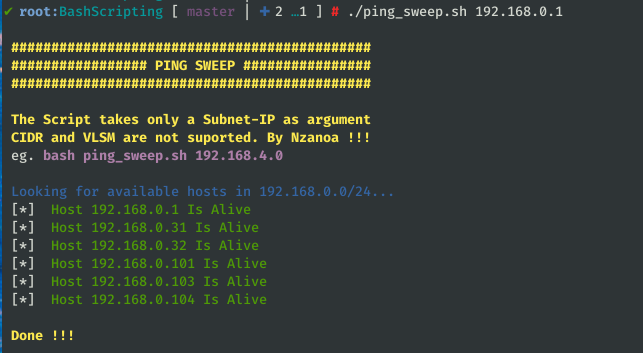
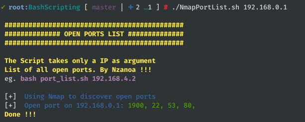

# Bash Scripts
## PING SWEEP
This script will help you discover hosts alive in a subnet.

> bash ping_sweep.sh 

## FULL PORTS LIST
This script will provide a list of all open port on a machine formated in a way that can be easily reused by other scanning tools.

> bash port_list.sh 

