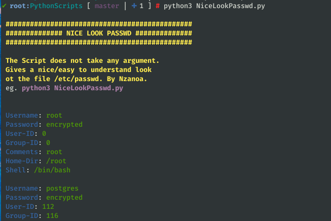

## Welcome to SystemAdmin Scripts
A few important scripts for Linux System Administrator

### PASSWD NICE LOOK
This script will help you understand better the content of /etc/passwd file

> python3 NiceLookPasswd.py

### SEND HTML EMAIL
This script can be helpful when trying to automate the process of sending html emails.

> python3 SendHTMLGmail.py

